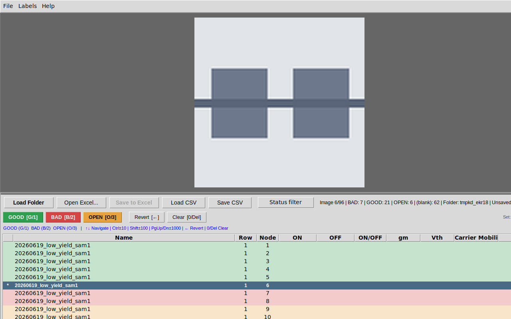

# ImageMarker

장치별 RGB 슬라이스 이미지를 검토하고, **설정 가능한 라벨 세트**(기본값 GOOD / BAD / OPEN)의 라벨을 실험실 Excel 스프레드시트의 `Status` 열에 직접 기록하는 Windows 데스크톱 도구입니다 (기존 CSV 지원 유지).

## 개요

ImageMarker는 장치별 이미지 슬라이스(`<name>_rgb_<row>_<node>.png`) 폴더를 **하위 폴더까지 포함해** 불러오므로, 하루치 측정 폴더의 `<sample>_slices` 폴더 전체를 한 번에 열 수 있습니다. 각 이미지를 정렬 가능한 테이블의 지표와 함께 보여주며, 리뷰어가 세트를 빠르게 훑어보고 단일 키 입력으로 `Status` 라벨을 지정할 수 있게 해줍니다. 라벨의 이름·색·단축키는 `Labels` 메뉴에서 전환·편집·가져오기·내보내기할 수 있는 라벨 세트가 정합니다.
소스 Excel 워크북이 로드된 상태에서는 편집한 상태 값이 **원본 파일에 그대로(in place)** 기록됩니다. 실제로 변경한 행의 `Status` 셀만 수정되며, 워크북의 다른 모든 셀·수식·서식은 전혀 건드리지 않습니다.

## 주요 기능

- **이미지 + 데이터 검토** — 상단에 이미지 캔버스(종횡비 유지, 창 크기에 맞춰 조정됨), 하단에 전체 데이터 테이블(Name, Row, Node, ON, OFF, ON/OFF, gm, Vth, Carrier Mobility, Status). 두 영역은 드래그 가능한 구분선으로 나뉘어 있어 마우스로 어느 쪽이든 자유롭게 크기를 조절할 수 있습니다.
- **재귀 폴더 로딩** — "Load Folder"는 선택한 폴더와 *그 아래 모든 하위 폴더*를 탐색하므로, 하루치 측정 폴더를 지정하면 그 안의 `<sample>_slices` 하위 폴더가 모두 한 번에 로드됩니다. 동일한 `(name, row, node)` 이미지가 여러 하위 폴더에 있으면 먼저 발견된 것이 유지되고(탐색은 알파벳 순서라 결정적입니다), 건너뛴 중복 개수는 정보 표시줄에 표시됩니다.
- **Excel 인플레이스 Status 업데이트** — 실험실의 `.xlsx` 워크북을 열고 로드된 각 샘플을 시트의 `Name`에 매칭한 뒤(한 세션에서 여러 샘플을 각각의 `Name`에 매칭 가능), 상태를 검토/수정하면 "Save to Excel"이 매칭된 모든 샘플에 걸쳐 변경된 `Status` 셀만 다시 기록합니다. 첫 번째 기록 전에 일회성 `<file>.backup.xlsx` 안전 복사본이 생성됩니다.
- **Status 필터링** — "Status filter" 드롭다운이 현재 존재하는 모든 고유 상태 값(`(blank)` 항목 포함)을 체크박스로 나열하며, All/None 빠른 선택 버튼을 제공합니다. 체크를 해제한 값은 테이블과 키보드 탐색 모두에서 숨겨집니다.
- **설정 가능한 라벨 세트** — `Labels` 메뉴에 프리셋 세 개가 있습니다. **GOOD / BAD / OPEN**(기본, 단축키 `G` `B` `O`), **PASS / FAIL**(`P` `F`), **Electrical (legacy 1.x)**(`Pass`, `No Active`, `No Gate Effect`, `Open`, `Short`를 `1`–`5`에, `→`=`Open` — ImageMarker 1.x와 동일). *Edit label set…*에서 라벨 추가·이름 변경·순서·색상을 편집하고 각 라벨에 단축키를 원하는 만큼 바인딩할 수 있습니다(키를 눌러 캡처). 중복 이름·중복 키·예약된 탐색 키는 거부됩니다. 세트는 작은 JSON 파일로 내보내기/가져오기가 되어 팀이 하나의 정의를 공유할 수 있고, 활성 세트는 세션 간에 기억됩니다.
- **키보드 중심 리뷰** — 마우스 없이 대량의 이미지를 탐색하고 다시 라벨링할 수 있습니다. 위/아래 화살표로 1/10/100/1000행 단위로 이동하고, 라벨 단축키(또는 항상 세트 순서를 따르는 숫자 키 `1`–`9`)로 현재 선택에 라벨을 적용하며, `0`/`Delete`로 지우고 `←`는 잘못 붙인 라벨을 소스 파일의 라벨로 되돌립니다 (다중 선택 지원 — 라벨 키는 선택된 모든 행에 적용됩니다). 라벨 적용 후 다음 행으로 자동 이동하는 *auto-advance* 옵션도 있습니다.
- **라벨 바** — 라벨마다 색이 칠해진 버튼(단축키 표시 포함)과 Revert / Clear 버튼을 제공해 마우스로도 리뷰할 수 있습니다.
- **시각적 피드백** — 테이블 행은 라벨 색으로 구분되며, 방금 적용한 라벨이 큰 오버레이로 1초 동안 깜빡입니다.
- **열 정렬** — 열 헤더를 클릭하여 정렬합니다(오름차순/내림차순 전환); 재정렬 시 현재 선택된 항목은 이전에 보고 있던 항목을 따라갑니다.
- **정보 표시줄** — 현재 위치, 상태별 개수(전체 세트와 활성 필터 모두), 폴더 이름(이미지 하위 폴더 탐색 수 및 중복 건너뛰기 수 포함), 소스 파일 이름, 그리고 저장되지 않은 변경 사항 수를 표시합니다.
- **저장되지 않은 변경 보호** — 라벨이 소스 파일의 값과 다른 동안에만 해당 행이 미저장 상태로 계산됩니다. 따라서 편집을 되돌리면(`←` 사용, 또는 원래 라벨을 다시 지정하기만 해도) 그 행의 미저장 상태도 함께 해제됩니다. 창 제목과 마커 열에 미저장 행이 표시되며, 저장하지 않고 닫으면 저장/무시/취소를 묻는 창이 나타납니다.
- **레거시 CSV 지원** — 프로토타입 도구의 기존 CSV 워크플로우(`name,row,node,label` + 임의의 추가 열)는 자체 로드/저장 메뉴 항목을 통해 여전히 작동합니다.

## 요구 사항

- Windows
- Python 3.9+ (소스에서 실행하려면)
- `requirements.txt`에 포함된 의존성: `pillow`, `openpyxl`

## 소스에서 실행

```bat
python -m venv .venv
.venv\Scripts\activate
pip install -r requirements.txt
python main.py
```

## Windows exe 빌드

포함된 spec 파일을 통해 PyInstaller로 단일 파일, 창 모드(콘솔 없음) 빌드가 생성됩니다.

```bat
build.bat
```

`build.bat`은 로컬 `.venv`를 생성하거나 재사용하고, `requirements.txt`와 `pyinstaller`를 설치하며, `pyinstaller ImageMarker.spec`를 실행하고 결과 경로를 출력합니다:

```
dist\ImageMarker.exe
```

빌드에는 `assets/icon.ico`에 있는 아이콘이 사용됩니다 (이미 저장소에 커밋되어 있습니다. 변경이 필요한 경우 `python assets/make_icon.py`를 사용하여 다시 생성하세요).

### 설치 프로그램

`dist\ImageMarker.exe`를 기반으로 [Inno Setup 6](https://jrsoftware.org/isinfo.php)을 사용하여 Windows 설치 프로그램을 빌드할 수 있습니다:

```bat
build_installer.bat
```

`build_installer.bat`은 `dist\ImageMarker.exe`가 존재하는지 확인하고(존재하지 않는 경우 `build.bat`으로 먼저 빌드하십시오), Inno Setup 6 컴파일러(`ISCC.exe`)를 찾아 `installer\ImageMarker.iss`를 컴파일하여 다음을 생성합니다:

```
dist\ImageMarker-Setup-2.0.0.exe
```

이 설치 프로그램은 기본적으로 사용자별로 설치되며(관리자 권한 프롬프트가 표시되지 않지만, 대신 관리자/모든 사용자 설치를 선택할 수도 있습니다), 시작 메뉴 바로가기를 추가하고 선택적으로 바탕 화면 아이콘을 제공하며, 다른 설치된 프로그램과 마찬가지로 Windows 설정 → 앱에서 나중에 제거할 수 있습니다.

## 키보드 단축키

### 탐색

| 키                | 동작                    |
|---------------------|---------------------------|
| `↑` / `↓`           | 선택 영역을 1만큼 이동       |
| `Ctrl` + `↑` / `↓`  | 선택 영역을 10만큼 이동      |
| `Shift` + `↑` / `↓` | 선택 영역을 100만큼 이동     |
| `Page Up` / `Page Down` | 선택 영역을 1000만큼 이동 |

상태 필터가 활성화된 경우, 탐색 및 위치 카운터는 현재 필터링된
뷰에서 작동합니다.

### 라벨 지정

현재 행에 적용되거나, 여러 행이 선택된 경우 선택된 모든 행에
적용됩니다. 라벨 키는 활성 라벨 세트(`Labels` 메뉴)에 따라 달라지며,
기본값은 다음과 같습니다.

| 키              | GOOD / BAD / OPEN (기본) | Electrical (legacy 1.x) |
|-----------------|--------------------------|-------------------------|
| `G` / `1`       | GOOD                     | Pass (`1`)              |
| `B` / `2`       | BAD                      | No Active (`2`)         |
| `O` / `3`       | OPEN                     | No Gate Effect (`3`)    |
| `4`, `→`        | —                        | Open                    |
| `5`             | —                        | Short                   |
| `Left`          | 원래 라벨로 되돌리기     | 되돌리기                |
| `0` 또는 `Delete` | 지우기 / 빈칸          | 지우기 / 빈칸           |

숫자 키 `1`–`9`는 항상 활성 세트의 순서대로 라벨을 선택합니다(`Labels`
메뉴에서 끌 수 있음). 문자 키는 Shift/Caps Lock과 무관하게 동작합니다.
`Left`는 라벨을 지정하지 않습니다 — 선택된 각 행을 소스 파일이 보유한
라벨(Excel 워크북이나 CSV에서 읽은 값, 또는 마지막으로 성공한 저장의 값;
소스 데이터가 없는 행은 빈값)로 되돌리고, 그 행의 미저장 마커도 함께
해제합니다.

`Ctrl+O`는 이미지 폴더 열기, `Ctrl+S`는 Excel 저장, `Ctrl+L`은 라벨 세트
편집기이며, *Help → Keyboard shortcuts*에서 활성 세트의 바인딩을 볼 수
있습니다.

## 라벨 세트

`Labels` 메뉴:

- 프리셋 세 개(라디오 항목) — 선택하면 활성 세트가 바뀝니다.
- **Edit label set…** — 활성 세트 편집기(프리셋을 편집하면 사용자 정의
  세트가 되고, 프리셋 자체는 바뀌지 않습니다).
- **Import label set…** / **Export label set…** — 아래와 같은 JSON 파일.
- **Digit keys 1-9 select labels in order**, **Auto-advance to next row
  after labeling** 토글.

활성 세트와 두 토글은 `%APPDATA%\ImageMarker\config.json`에 저장됩니다.

```json
{
  "schema_version": 1,
  "name": "GOOD / BAD / OPEN",
  "labels": [
    {"name": "GOOD", "color": "#2e9e4f", "keys": ["g"], "description": "Device looks functional"},
    {"name": "BAD",  "color": "#d64545", "keys": ["b"]},
    {"name": "OPEN", "color": "#e8a33d", "keys": ["o"]}
  ]
}
```

`name`은 `Status` 셀에 그대로 기록되고, `keys`는 tkinter 키 이름(`g`,
`1`, `Right`, `F5`, `Insert`, …)을 씁니다. 세트당 최대 9개 라벨. 워크북에
이미 있지만 활성 세트에 없는 Status 값은 그대로 유지·표시(흰 행)됩니다 —
세트는 단축키가 무엇을 기록하고 알려진 라벨을 어떤 색으로 보여줄지만
정합니다.

## Excel 워크플로우

1. **Load Folder** — 이미지가 포함된 폴더를 선택하세요. 하위 폴더도 포함되므로, 전체 측정 폴더를 선택하면 그 아래에 있는 모든 `<sample>_slices` 하위 폴더를 한 번에 불러옵니다.
2. **Open Excel…** — `.xlsx` 워크북을 선택합니다 (첫 번째 시트가 자동으로 사용됩니다).
3. **Excel 이름과 샘플 매칭** — 이미지 파일 이름과 Excel `Name` 값이 공통된 접두사를 공유하지 않기 때문에, ImageMarker는 양쪽에서 샘플 번호를 추출하여 가장 적합한 매칭을 미리 선택합니다. 그런 다음 대화 상자에 로드된 샘플당 한 행(이미지 이름 접두사, 이미지 개수, Excel `Name` 드롭다운)이 표시되어 각 쌍을 확인하거나 변경할 수 있습니다. 한 세션에서 여러 샘플을 각각의 `Name`에 매칭할 수 있으며, 워크북에 대응하는 항목이 없는 샘플은 `(skip)`으로 설정할 수 있습니다. 각 샘플의 행은 해당 `Name` 내에서 `(Row, Node)`를 기준으로 이미지와 결합되며, 요약 정보에는 샘플별 매칭/미매칭 개수가 표시됩니다.
4. **Review / edit** — 일치하는 행은 메트릭 열(ON, OFF, ON/OFF, gm, Vth, Carrier Mobility)과 기존 `Status`를 채우며, 일치하는 Excel 데이터가 없는 행은 표시되고 빈칸으로 남습니다. 위의 키보드 단축키를 사용하여 `Status`를 수정하십시오.
5. **Save to Excel** — 저장되지 않은 변경 사항이 있을 때 활성화됩니다. 처음 저장할 때 소스 워크북 옆에 `<file>.backup.xlsx` 복사본이 생성됩니다(일회성 안전 백업). 그 후 원본 파일이 다시 열리고 사용자가 변경한 행의 `Status` 셀만 업데이트 및 저장됩니다. 워크북의 다른 항목(다른 열, 약 201개의 스윕 데이터 열, 서식 등)은 수정되지 않습니다. 파일이 Excel에서 열려 있는 경우, 메시지 상자가 표시되어 파일을 닫고 다시 시도할 것을 요청합니다.

이 도구는 다른 Excel 열을 절대 수정하지 않으며, 이미지 파일도 절대 수정되지 않습니다.

## Legacy CSV 지원

Excel 워크북이 없는 폴더의 경우, 프로토타입의 기존 CSV 워크플로우(`name,row,node,label` 및 기타 추가 열)가 자체 로드/저장 메뉴 항목을 통해 계속 작동합니다. 라벨은 활성 세트의 표기로 읽히며(`good` → `GOOD`), 1.x의 별칭(`1` → `Pass`, `-1` → `Open`, `ok` → `Pass`, …)은 해당 라벨이 활성 세트에 있을 때만 적용되므로 `GOOD`이 조용히 `Pass`로 바뀌는 일은 더 이상 없습니다.

## 스크린샷



_기본 GOOD / BAD / OPEN 세트의 메인 창: 이미지 캔버스, 라벨 바, 힌트 줄, 라벨 색으로 구분된 데이터 테이블 (합성 샘플 데이터)._
